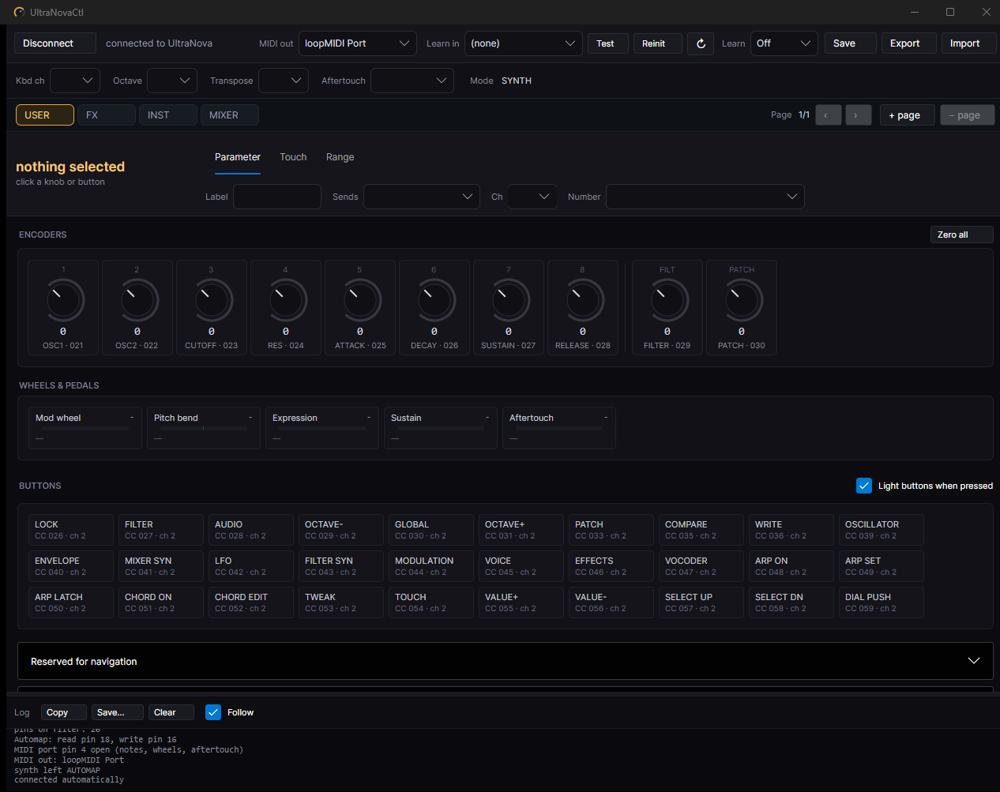
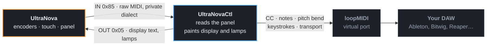
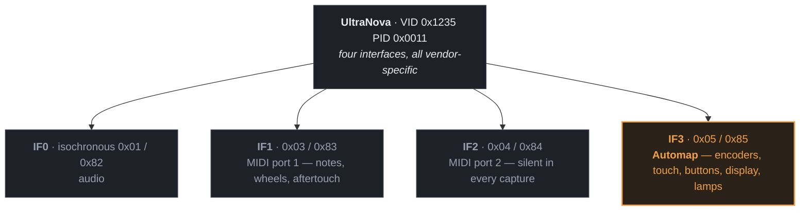
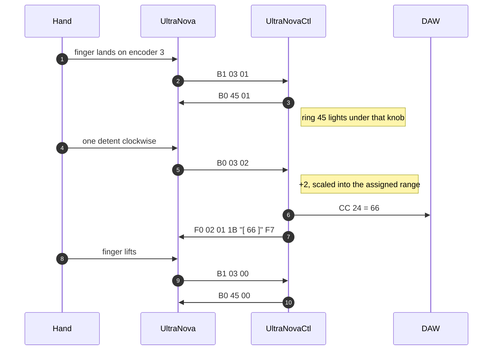
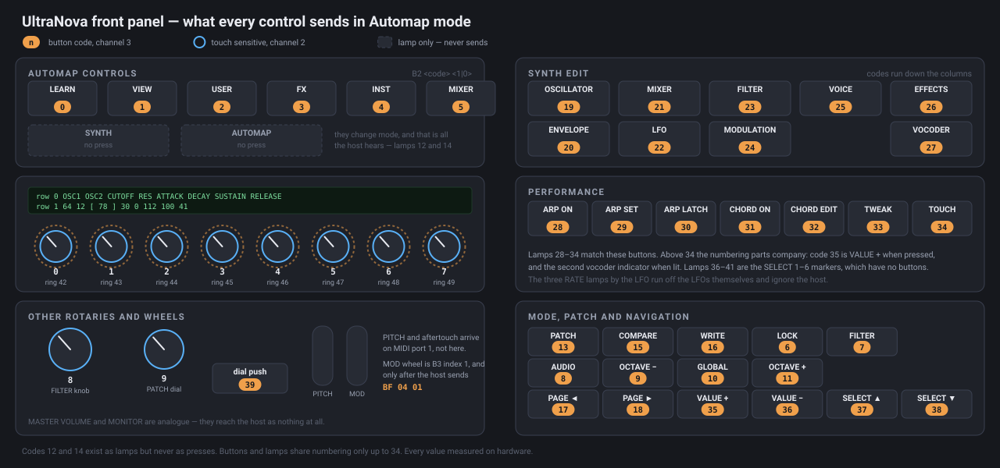

# UltraNovaCtl

Languages: **English** · [Русский](README.ru.md)



Developed by: Alexander Lavrinovich<br>
GitHub: https://github.com/Alex-Electron<br>
Email: lavrinovich.alex@gmail.com

If you've enjoyed the project, it would be really nice of you to buy me a cup of coffee:

[](https://ko-fi.com/G2F222TXLI) [](https://www.donationalerts.com/r/alex_electron)

A replacement for Novation's **Automap**, for the **UltraNova** synthesizer. It takes the
eight touch-sensitive encoders, the filter knob, the patch dial and the whole front panel —
all of which go silent the moment the instrument enters Automap mode — and turns them into
ordinary MIDI that any DAW can map. It writes back too: your own labels and live values on
the synth's display, and every lamp on the panel under program control.

The instrument becomes the controller it was sold as, without the software that stopped
being maintained.


---

## Why this exists

Put an UltraNova in Automap mode and its most useful controls vanish. The encoders send
nothing on the USB MIDI ports, nothing on the DIN sockets, and nothing on the `Automap MIDI`
virtual port the stock software installs. They are not idle — they are talking on a private
vendor USB endpoint in a private dialect, to a piece of software that will only hand the
result to plug-ins as host automation, never as MIDI you can route.

So the encoders are unusable for anything Automap did not think of, and Automap itself is
long unmaintained.

This program speaks that dialect. It reads the panel directly, writes to the instrument's
display and lamps, and sends whatever you assign to a normal MIDI port:



Everything found along the way is written down, so the reverse-engineering stays useful
even to someone who never runs this application.

---

## How it works

The instrument presents four USB interfaces and **not one of them is USB-MIDI class** — all
four are vendor-specific. Three carry what you would expect. The fourth is the one nothing
else knows how to talk to.



Turning one knob is a conversation, not a message. Touch arrives before the turn does, the
ring lights from the host, and the value on the synth's own display is text this program
writes there:



Full write-up: [docs/PROTOCOL.md](docs/PROTOCOL.md).

---

## The panel, mapped

Every code here came off the wire — a button was pressed, or a lamp code was sent and
somebody looked at the instrument. None of it is inferred from the order of names in a
manual; that was tried, and it was wrong.



Reference table: [docs/PANEL-MAP.md](docs/PANEL-MAP.md).

---

## What it does

**Controls it reads**

- the eight encoders, with acceleration, plus the filter knob and the patch dial
- touch on all ten encoders — assignable separately from the turn
- 40 panel buttons, including the patch dial push
- modulation wheel, pitch bend, aftertouch, expression and sustain pedals
- keyboard channel, octave, transpose and aftertouch settings — readable and settable

**What you can send**

| | |
|---|---|
| Control Change | any controller, any channel, with a working range |
| Note On/Off | picked by name, `Note 042 (F#1)` |
| Pitch Bend | full 14-bit |
| Keystroke | any key combination, typed into the focused window |
| Transport | Start / Stop / Continue, and MMC play, stop, pause, record, record exit, fast forward, rewind, return to zero |
| Disabled | leaves the control alone |

**How a control behaves** — knobs: Normal, Inverted, and four relative encodings (Two's
Complement, Signed Bit, Signed Bit 2, Binary Offset). Buttons: Momentary, Normal, Toggle,
and Step with any number of positions.

**Banks and pages** — four banks reached from the panel's USER, FX, INST and MIXER buttons,
each with as many pages as you like, stepped with the panel's page buttons.

**Feedback on the instrument** — labels and live values on the synth's own display, rings
lit under the encoders you touch, the active bank lit on its button, page buttons lit only
when there is somewhere to go, VIEW lit while the editor window is open. Button lamps follow
the assignment: a momentary lights while held, a toggle stays lit while it is on. Pick a
button in the window and it blinks on the panel so your hand finds it.

**Learn** — listen on any MIDI input and take the next controller that moves, for mapping
against a plug-in or a second instrument.

**Import** — reads Novation `.automap` files, so existing maps come across.

---

## What you need

Three things, and one thing to get out of the way.

| | |
|---|---|
| **Novation USB driver 2.30** | **Required.** The UltraNova has no USB-MIDI class interfaces at all — every one of its four USB interfaces is vendor-specific, so Windows cannot bind an in-box driver and exposes no device to open. [Download](https://downloads.focusrite.com/novation/synthesisers/ultranova) and install it before plugging the synth in. |
| **A virtual MIDI port** | **Required.** This program creates no ports of its own; it sends to one that exists and your DAW listens to the other end. [loopMIDI](https://www.tobias-erichsen.de/software/loopmidi.html) is free for personal use — install, run, click `+`. |
| **UltraNovaCtl** | A single self-contained `.exe` from [Releases](https://github.com/Alex-Electron/UltraNovaCtl/releases). **.NET does not need to be installed.** |
| **The stock Automap** | Must not be running. `AutomapServer.exe` and `MidiAutomapClient.exe` hold the same USB endpoint and answer the synth first. Quit them, or uninstall Automap 4 — nothing here needs it. |

> **Avoid `midi.exe loopback create` from Windows MIDI Services.** It works, and it will
> quietly ruin the rest of your MIDI: on the development machine its endpoints pushed port
> enumeration from 90 ms to 265 ms and stopped Ableton Live opening *any* MIDI input, the
> synth's own port included. They route through the `MidiSrv` service that now backs all of
> WinMM. loopMIDI has its own driver and leaves that alone.

## Getting started

1. Start **loopMIDI** and make a port.
2. Start your **DAW** — after the port exists. Live builds its device list once, at startup.
3. Run **`UltraNovaCtl.exe`** and pick the port under **MIDI out**.
4. Press **AUTOMAP** on the instrument. The status line reads `connected to UltraNova` and
   the display fills with labels.
5. In the DAW, enable the loopMIDI port as an input and tick both **Remote** and **Track**.

Turn encoder 1 — CC 21 should move. Click any knob or button in the window to reassign it,
then press **Save**.

**→ [The full guide](docs/GUIDE.md)** — every control, every send type, every mode, learn,
banks and pages, panel feedback, and what to do when something is wrong.

---

## Repository layout

```
UltraNovaCtl/
├── README.md                  # this file (English)
├── README.ru.md               # Russian
├── LICENSE                    # MIT
├── UltraNovaCtl.sln
├── docs/
│   ├── GUIDE.md               # the full guide — start here
│   ├── GUIDE.ru.md            # …in Russian
│   ├── PROTOCOL.md            # the Automap protocol, as captured from the wire
│   ├── PANEL-MAP.md           # every button, lamp and encoder code
│   └── BUILD.md               # how to build it
├── img/
│   ├── app.png                # the window
│   └── panel-map.svg          # the panel diagram above
└── src/
    ├── Core/                  # protocol engine, Kernel Streaming, config model, MIDI out
    ├── Gui/                   # Avalonia window and tray icon
    └── KsMidiMon/             # console tool: list filters, enumerate pins, dump the stream
```

Build instructions: [docs/BUILD.md](docs/BUILD.md). Short version: `dotnet build`.

---

## Known limits

- **Windows only for now.** The GUI is cross-platform; the hardware layer is Kernel
  Streaming and WinMM. Two files stand between this and a Linux or macOS build — see
  [docs/BUILD.md](docs/BUILD.md).
- **The synth cannot be pushed out of Automap mode.** Only its own SYNTH button does that.
  The stock software could not do it either.
- **The DIN sockets are not bridged to USB.** The instrument's own guide is explicit that
  it is not a computer MIDI interface, so driving external hardware needs a separate
  USB-MIDI interface.
- **Killing the process leaves the MIDI port busy** for a while, which looks like the DAW
  quietly stopping. Close the window instead — it hides to the tray, and Exit is in the
  tray menu.

## Roadmap

Start with Windows, an installer that sets up the virtual port, mass clear and revert of
assignments, pickup for wheels and pedals, drag-and-drop to swap assignments, MIDI clock
output.

---

## License

MIT. See [LICENSE](LICENSE).

Not affiliated with, endorsed by, or supported by Focusrite or Novation. *Automap*,
*Novation* and *UltraNova* are their trademarks, used here only to say what this works with.

## Author

**Alexander Lavrinovich** · <lavrinovich.alex@gmail.com> · [github.com/Alex-Electron](https://github.com/Alex-Electron)
