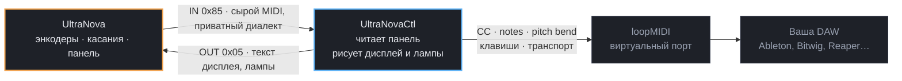
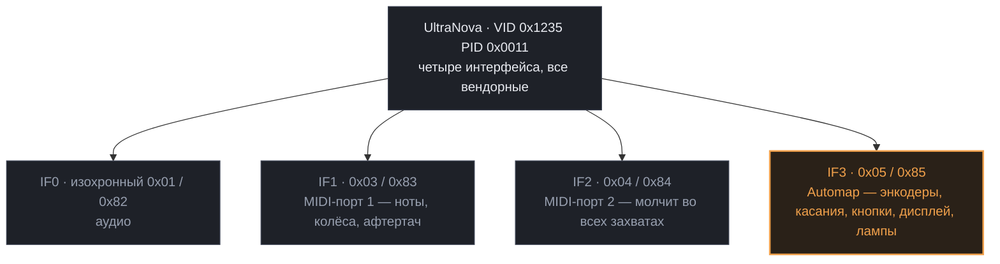
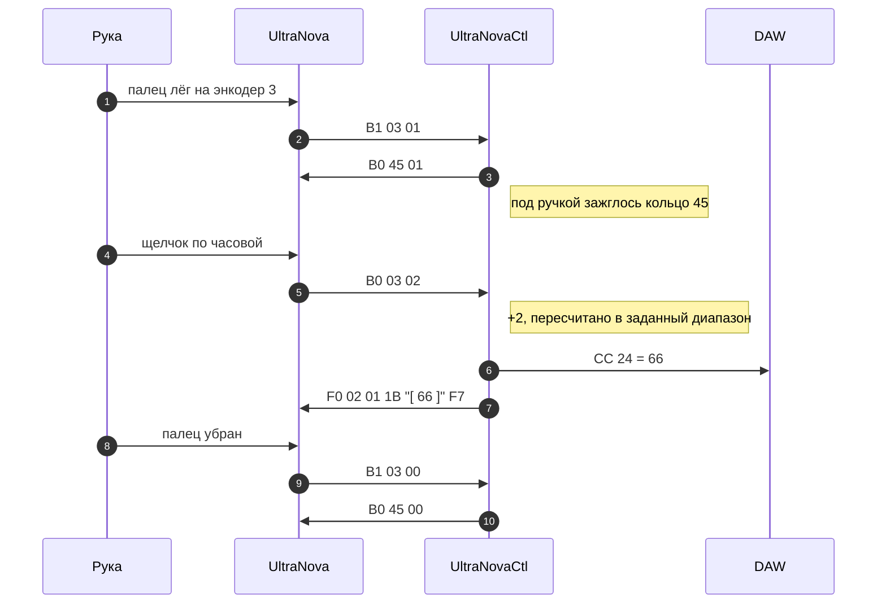

# UltraNovaCtl

Языки: [English](README.md) · **Русский**


Автор: Alexander Lavrinovich<br>
GitHub: https://github.com/Alex-Electron<br>
Email: lavrinovich.alex@gmail.com

Если проект вам пригодился, будет очень приятно, если купите мне чашку кофе:

[](https://ko-fi.com/G2F222TXLI) [](https://www.donationalerts.com/r/alex_electron)

Замена Novation **Automap** для синтезатора **UltraNova**. Восемь сенсорных энкодеров, ручка
фильтра, колесо патчей и вся передняя панель — всё, что замолкает в тот момент, когда
инструмент переходит в режим Automap, — превращаются в обычный MIDI, который сопоставит любая
DAW. И обратно тоже: ваши собственные метки и живые значения на дисплее синтезатора, и каждая
лампа на панели под управлением программы.

Инструмент становится тем контроллером, каким его продавали, — без софта, который перестали
поддерживать.


---

## Зачем

Переведите UltraNova в режим Automap — и самые полезные органы управления исчезают.
Энкодеры не шлют ничего ни на USB-порты MIDI, ни на DIN-разъёмы, ни на виртуальный порт
`Automap MIDI`, который ставит штатная программа. Они не молчат: они разговаривают по
приватному вендорному USB-эндпоинту на приватном же диалекте — с программой, которая отдаёт
результат плагинам автоматизацией хоста, но никогда не отдаёт как MIDI, который можно
куда-то направить.

В итоге энкодеры бесполезны для всего, что не предусмотрел Automap, а сам Automap давно не
развивается.

Эта программа говорит на том самом диалекте. Она читает панель напрямую, пишет на дисплей и
светодиоды инструмента и отправляет назначенное в обычный MIDI-порт:



Всё найденное записано, так что результат реверс-инжиниринга остаётся полезным и тому,
кто никогда не запустит саму программу.

---

## Что умеет

**Что читает**

- восемь энкодеров с ускорением, ручку фильтра и колесо патчей
- прикосновение ко всем десяти энкодерам — назначается отдельно от вращения
- 40 кнопок панели, включая нажатие колеса патчей
- колесо модуляции, питч-бенд, афтертач, педали экспрессии и сустейна
- канал клавиатуры, октаву, транспонирование и афтертач — читает и задаёт

**Что отправляет**

| | |
|---|---|
| Control Change | любой контроллер, любой канал, с рабочим диапазоном |
| Note On/Off | выбор по имени, `Note 042 (F#1)` |
| Pitch Bend | полные 14 бит |
| Keystroke | любое сочетание клавиш — в активное окно |
| Transport | Start / Stop / Continue и MMC: play, stop, pause, record, record exit, перемотки, возврат в ноль |
| Disabled | контрол не трогается |

**Режимы.** Для ручек: Normal, Inverted и четыре относительных кодировки (Two's Complement,
Signed Bit, Signed Bit 2, Binary Offset). Для кнопок: Momentary, Normal, Toggle и Step с
любым числом позиций.

**Банки и страницы.** Четыре банка на кнопках панели USER, FX, INST и MIXER, в каждом
сколько угодно страниц, переключаются кнопками страниц на панели.

**Обратная связь на инструменте.** Метки и живые значения на дисплее синтезатора, кольца под
теми энкодерами, которых касаешься, активный банк подсвечен на своей кнопке, кнопки страниц
горят только когда есть куда идти, VIEW горит пока открыто окно редактора. Лампа кнопки
следует режиму: momentary горит пока держишь, toggle остаётся гореть пока включён. Выберите
кнопку в окне — она помигает на панели, чтобы рука её нашла.

**Learn.** Слушает любой MIDI-вход и берёт первый пошевелившийся контроллер — для сопоставления
с плагином или вторым инструментом.

**Импорт.** Читает файлы Novation `.automap`, так что готовые карты переносятся.

---

## Что нужно

Три вещи и одна, которую надо убрать с дороги.

| | |
|---|---|
| **Драйвер Novation USB 2.30** | **Обязательно.** У UltraNova вообще нет интерфейсов класса USB-MIDI — все четыре вендорные, поэтому Windows не может привязать встроенный драйвер и не показывает устройства, которое можно открыть. [Скачать](https://downloads.focusrite.com/novation/synthesisers/ultranova) и поставить до подключения синтезатора. |
| **Виртуальный MIDI-порт** | **Обязательно.** Программа не создаёт портов; она пишет в существующий, а DAW слушает другой его конец. [loopMIDI](https://www.tobias-erichsen.de/software/loopmidi.html) бесплатен для личного использования — поставить, запустить, нажать `+`. |
| **UltraNovaCtl** | Один самодостаточный `.exe` из [Releases](https://github.com/Alex-Electron/UltraNovaCtl/releases). **.NET ставить не надо.** |
| **Штатный Automap** | Не должен работать. `AutomapServer.exe` и `MidiAutomapClient.exe` держат тот же USB-эндпоинт и отвечают синтезатору первыми. Закройте их или удалите Automap 4 — здесь он не нужен ни для чего. |

> **Не используйте `midi.exe loopback create` из Windows MIDI Services.** Оно работает — и
> тихо ломает весь остальной MIDI: на машине разработки его эндпоинты увеличили перечисление
> портов с 90 мс до 265 мс и заставили Ableton Live не открывать *ни одного* MIDI-входа,
> включая штатный порт синтезатора. Они идут через службу `MidiSrv`, на которую теперь
> опирается весь WinMM. У loopMIDI свой драйвер, эту службу он не трогает.

---

## С чего начать

1. Запустите **loopMIDI** и создайте порт.
2. Запустите **DAW** — уже после того, как порт появился. Live строит список устройств один
   раз, при старте.
3. Запустите **`UltraNovaCtl.exe`** и выберите порт в **MIDI out**.
4. Нажмите **AUTOMAP** на инструменте. В строке состояния появится `connected to UltraNova`,
   а дисплей заполнится метками.
5. В DAW включите порт loopMIDI как вход и поставьте галочки **Remote** и **Track**.

Покрутите первый энкодер — должен зашевелиться CC 21. Щёлкните по любой ручке или кнопке в
окне, чтобы переназначить, и нажмите **Save**.

**→ [Полное руководство](docs/GUIDE.ru.md)** — каждый контрол, все типы отправки, все режимы,
обучение, банки и страницы, обратная связь на панели и что делать, когда что-то не так.

---

## Как это устроено

У инструмента четыре USB-интерфейса, и **ни один из них не класса USB-MIDI** — все четыре
вендорные. Три несут ожидаемое. Четвёртый — тот самый, с которым больше никто не умеет
разговаривать.



Поворот одной ручки — это разговор, а не сообщение. Касание приходит раньше вращения,
кольцо зажигает хост, а значение на дисплее синтезатора — текст, который туда пишет
эта программа:



Подробно: [docs/PROTOCOL.md](docs/PROTOCOL.md).

---

## Карта панели

Каждый код здесь снят с провода — кнопка была нажата, или код лампы отправлен и кто-то
посмотрел на прибор. Ничего не выведено из порядка названий в руководстве; так пробовали,
и получилось неверно.


Таблица: [docs/PANEL-MAP.md](docs/PANEL-MAP.md).

---

## Структура репозитория

```
UltraNovaCtl/
├── README.md                  # английская версия
├── README.ru.md               # этот файл
├── LICENSE                    # MIT
├── UltraNovaCtl.sln
├── docs/
│   ├── GUIDE.ru.md            # полное руководство — начинать отсюда
│   ├── GUIDE.md               # …по-английски
│   ├── PROTOCOL.md            # протокол Automap, снятый с провода
│   ├── PANEL-MAP.md           # коды всех кнопок, ламп и энкодеров
│   └── BUILD.md               # как собрать
├── img/
│   ├── app.png                # окно
│   └── panel-map.svg          # схема панели выше
└── src/
    ├── Core/                  # движок протокола, Kernel Streaming, модель настроек, MIDI-выход
    ├── Gui/                   # окно Avalonia и иконка в трее
    └── KsMidiMon/             # консольная утилита: фильтры, пины, дамп потока
```

Сборка — [docs/BUILD.md](docs/BUILD.md). Коротко: `dotnet build`.

---

## Ограничения

- **Пока только Windows.** Интерфейс кроссплатформенный, аппаратный слой — Kernel Streaming
  и WinMM. Между этим и сборкой под Linux/macOS стоят два файла, подробности в
  [docs/BUILD.md](docs/BUILD.md).
- **Вывести синтезатор из режима Automap программно нельзя** — только его собственной
  кнопкой SYNTH. Штатная программа этого тоже не умела.
- **DIN-разъёмы не связаны с USB.** Руководство инструмента прямо говорит, что он не
  является компьютерным MIDI-интерфейсом, — для внешнего железа нужен отдельный
  USB-MIDI-интерфейс.
- **Снятие процесса оставляет MIDI-порт занятым** на некоторое время, и выглядит это как
  «DAW молча перестала принимать». Закрывайте окно — оно сворачивается в трей, а выход есть
  в меню трея.

---

## Планы

Автозапуск с Windows, инсталлятор, который сам настраивает виртуальный порт, массовые
очистка и откат назначений, pickup для колёс и педалей, перетаскивание назначений мышью,
выдача MIDI clock.

---

## Лицензия

MIT, см. [LICENSE](LICENSE).

Проект не связан с Focusrite и Novation, ими не одобрен и не поддерживается. *Automap*,
*Novation* и *UltraNova* — их товарные знаки, упомянуты только чтобы указать совместимость.

---

## Автор

**Alexander Lavrinovich** · <lavrinovich.alex@gmail.com> · [github.com/Alex-Electron](https://github.com/Alex-Electron)
